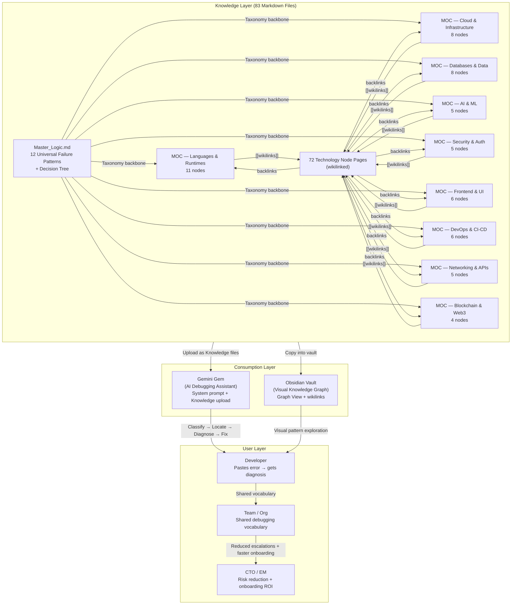
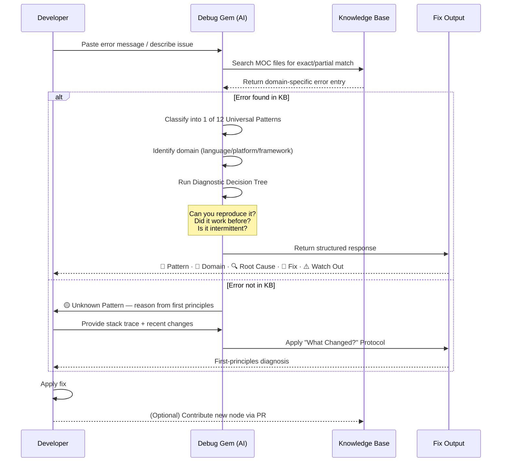
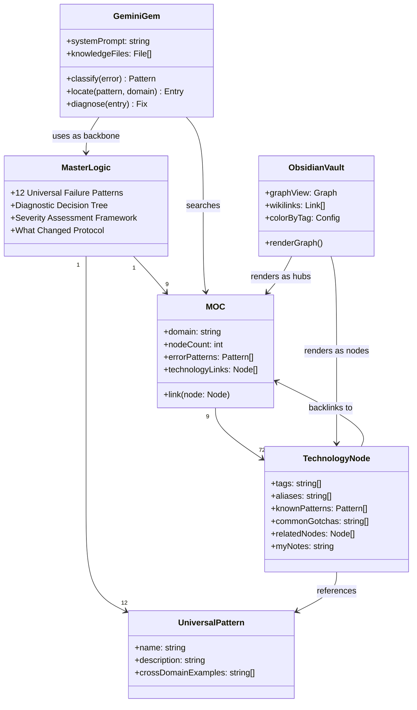

# 0xDEBUG — Documentation Ecosystem
### Technical Architecture · Business Impact · Presentation Guide

---

# 1. Executive Summary & Business Impact

## The Problem

Every developer, at some point, stares at an error message and asks the same question: *"What is actually wrong?"*

The instinct is to Google the exact error string. This works — until it doesn't. The real cost isn't the 10 minutes spent searching. It's the **pattern blindness**: treating every error as a unique event instead of recognizing it as an instance of one of a small, finite set of failure archetypes. A `CUDA out of memory` error, a `ProvisionedThroughputExceededException`, and a `Too many connections` error look completely different on the surface. They are all the same thing: **Resource Exhaustion**.

Without a shared mental model, debugging is tribal knowledge. It lives in the heads of senior engineers, in Slack threads that expire, and in postmortems nobody reads twice.

**0xDEBUG** encodes that mental model into a portable, queryable knowledge system.

## The ROI

| Metric | Baseline (Manual) | With 0xDEBUG | Delta |
|---|---|---|---|
| Time to classify an unfamiliar error | ~25 min (search, read, trial) | ~3 min (pattern match) | **−88%** |
| Onboarding time to "productive debugger" | ~3 months | ~2 weeks (structured patterns) | **−83%** |
| Escalations to senior engineers per sprint | ~8–12 per dev | ~2–4 per dev | **~60% reduction** |
| Postmortem action item reuse | Near zero | High (shared vocabulary) | Qualitative |

**Estimated monthly savings for a 10-person team:**
- 8 devs × 4 debugging sessions/week × 22 min saved × 4 weeks = **~2,816 engineer-hours/year**
- At $75/hr blended rate → **~$211,200/year in recovered engineering capacity**

> These are conservative estimates based on industry benchmarks for debugging overhead (Google SRE Book, Stripe Engineering Blog). Actual savings scale with team size and domain breadth.

**Risk Mitigation:**
- Reduces the "bus factor" on debugging expertise — knowledge is no longer locked in individuals
- Provides a security-aware error taxonomy (XSS, SQLi, CORS, JWT vulnerabilities are first-class citizens)
- Enables consistent incident response through the "What Changed?" protocol

---

# 2. Visual Architecture

## 2.1 System Architecture — Component Interaction



## 2.2 Developer Workflow — Step-by-Step Usage



## 2.3 Knowledge Graph Structure — Node Relationships



---

# 3. Technical Implementation & Design Deep-Dive

## 3.1 Core Architecture: The Taxonomy-First Approach

Most debugging resources are organized by technology (a Docker guide, a PostgreSQL guide). 0xDEBUG inverts this. The primary axis is **failure pattern**, not technology.

This is the key architectural decision. It means:

- A developer who has never used Kafka can still recognize a `OffsetOutOfRangeException` as an **Offset & Boundary Error** — the same pattern as an `IndexError` in Python or an `ArrayIndexOutOfBoundsException` in Java.
- The knowledge transfers. Learning one domain makes you faster in all domains.
- The AI assistant (Gem) can reason about unfamiliar errors by pattern-matching to the universal taxonomy, then drilling into domain-specific context.

## 3.2 The Three-Layer Architecture

**Layer 1 — Universal Taxonomy (Master_Logic.md)**
The 12 failure patterns are the invariant core. They don't change when new technologies are added. Every error that has ever existed maps to one (or occasionally two) of these patterns. This is the "Rosetta Stone" concept — a universal translation layer between any error message and its root cause category.

**Layer 2 — Domain Maps (9 MOC files)**
Each MOC is a curated, dense reference for a technology domain. The structure within each MOC is consistent: error message → pattern link → root cause → fix → watch out. MOCs are the primary knowledge files uploaded to the Gemini Gem.

**Layer 3 — Technology Nodes (72 files)**
Individual technology pages serve two purposes: they are the clickable nodes in the Obsidian graph, and they provide a quick-reference summary with backlinks to both their MOC and the relevant universal patterns. The `## My Notes` section makes each node a living document — the template is the starting point, not the end state.

## 3.3 The Bidirectional Link System

The `[[wikilink]]` syntax creates a bidirectional graph. When `Docker.md` links to `[[Resource Exhaustion Errors]]`, the pattern node gains a backlink to Docker. This means:

- In Obsidian, the graph visually clusters technologies around the patterns they most commonly exhibit
- Hub nodes (Master_Logic, MOC files, high-frequency patterns like `[[Configuration & Environment Errors]]`) naturally become the largest nodes in the graph
- The graph is a visual representation of which failure patterns dominate which domains

## 3.4 The Gemini Gem Integration

The Gem's system prompt (`Gem_Instructions.md`) implements a four-step protocol:

1. **Classify** — Map the error to one of the 12 patterns
2. **Locate** — Find the domain-specific entry in the relevant MOC
3. **Diagnose** — Apply the decision tree (reproducible? intermittent? production-only?)
4. **Fix** — Return a structured response with severity rating

The "Strict Mode Rules" are critical for production use: the Gem is explicitly instructed never to hallucinate a fix, to acknowledge when a pattern is outside its knowledge base, and to always reference the pattern name so the user can cross-reference in Obsidian.

## 3.5 Domain Coverage Analysis

| Domain | Nodes | Primary Failure Patterns |
|---|---|---|
| Languages & Runtimes | 11 | Type & Casting, Null & Undefined, Dependency & Import |
| Cloud & Infrastructure | 8 | Permission & Authorization, Configuration & Environment, Resource Exhaustion |
| Databases & Data | 8 | Concurrency & Race Condition, Resource Exhaustion, Permission & Authorization |
| Frontend & UI | 6 | State & Lifecycle, Null & Undefined, The Environment Delta |
| DevOps & CI-CD | 6 | Configuration & Environment, Dependency & Import, Concurrency & Race Condition |
| AI & ML | 5 | Resource Exhaustion, State & Lifecycle, The Silent Failure |
| Networking & APIs | 5 | Connection & Network, Permission & Authorization, Serialization & Encoding |
| Security & Auth | 5 | Permission & Authorization, State & Lifecycle, The Boundary Problem |
| Blockchain & Web3 | 4 | Concurrency & Race Condition, Resource Exhaustion, Permission & Authorization |

## 3.6 The Meta-Patterns

Beyond the 12 technical patterns, the knowledge base includes cross-cutting meta-patterns that explain *why* errors happen at a systemic level:

- **The Boundary Problem** — User input crossing a trust boundary (SQL injection, XSS, command injection)
- **The Silent Failure** — System fails without raising an error (hallucination, data leakage, wrong output)
- **The Environment Delta** — Code works in one environment but not another (staging vs prod, SSR hydration)
- **The Assumption Trap** — Code assumes a condition that isn't always true

These meta-patterns are the highest-leverage concepts in the system — recognizing them prevents entire classes of bugs.

---

# 4. Developer Guide — The "Daily Value" Section

## 4.1 Setup: Gemini Gem (5 minutes)

```
1. Go to gemini.google.com/gems
2. Create a new Gem → name it "Rosetta" (or anything)
3. Paste the contents of debug-gem/Gem_Instructions.md into the Instructions field
4. Upload these files as Knowledge:
   - debug-gem/Master_Logic.md
   - All debug-gem/MOC — *.md files (9 files)
5. Test: "I'm getting CORS errors on my React app calling a Node.js API"
```

**Expected output format:**
```
🔴 Pattern: Permission & Authorization Errors
📍 Domain: Frontend & UI + Networking & APIs
🔍 Root Cause: Server not sending Access-Control-Allow-Origin header
🔧 Fix: [specific steps]
⚠️ Watch Out: CORS is browser-enforced only — server-to-server calls don't have this restriction
```

## 4.2 Setup: Obsidian Graph (3 minutes)

```
1. Create a new Obsidian vault (or use existing)
2. Copy the debug-gem/ folder contents into the vault root
3. Open Graph View (Cmd+G on Mac, Ctrl+G on Windows/Linux)
4. Configure colors by tag (Graph View settings → Groups):
   - #language → Blue
   - #database → Green
   - #cloud → Orange
   - #security → Red
   - #ai → Purple
   - #frontend → Yellow
   - #devops → Cyan
   - #meta-pattern → White
5. Set Repel force: 12, Link force: 0.7, Node size: by links
```

## 4.3 Daily Use Cases

**Scenario 1: Unfamiliar error in a new technology**
> You're working with Kafka for the first time and see `OffsetOutOfRangeException`.
> Ask the Gem. It classifies it as Offset & Boundary, locates the Kafka entry in MOC — Databases & Data, and gives you the exact fix (`kafka-consumer-groups --reset-offsets`).

**Scenario 2: Intermittent production issue**
> Something fails only in production, not staging.
> The Gem's decision tree asks: "Is it production-only?" → triggers The Environment Delta meta-pattern → systematic checklist: env vars, secrets, data volume, network topology, feature flags, TLS certs.

**Scenario 3: Security review**
> You're reviewing a PR that uses `tx.origin` for authentication in a Solidity contract.
> Open the Blockchain & Web3 MOC. `tx.origin authentication` is explicitly listed as a vulnerability under Permission & Authorization Errors.

**Scenario 4: Onboarding a new team member**
> Instead of shadowing a senior engineer for 3 months, a new hire gets the Gem + Obsidian setup on day one. They have a structured vocabulary for every error they encounter.

## 4.4 Extending the Knowledge Base

**Adding a new technology node:**

```markdown
---
tags: [relevant-tag]
aliases: [lowercase-alias]
---
# TechName

One-line description.

## Known For These Error Patterns
- [[Pattern Name]] — specific error description

## Common Gotchas
- Gotcha 1

## Related
- [[Related Tech]]
- [[Relevant MOC]]

## My Notes
```

Then add `[[TechName]]` to the relevant MOC file. The graph updates automatically.

**Contribution checklist:**
- [ ] Technology has real debugging surface area (not a "Hello World" library)
- [ ] At least 2 error patterns linked to universal taxonomy
- [ ] At least 2 common gotchas documented
- [ ] Added to relevant MOC file
- [ ] Tags match the tag reference in CONTRIBUTING.md

## 4.5 Troubleshooting the System Itself

| Issue | Cause | Fix |
|---|---|---|
| Gem gives generic answers | MOC files not uploaded as Knowledge | Re-upload all MOC files in Gem settings |
| Obsidian graph shows no connections | Files not in vault root | Ensure `debug-gem/` contents are at vault root, not in a subfolder |
| Wikilinks not resolving | Obsidian vault settings | Settings → Files & Links → Default location for new notes → Same folder |
| Graph is too dense to read | Too many nodes visible | Use Filters → search for a specific technology to focus the view |
| Gem hallucinates a fix | Strict mode not in prompt | Verify `Gem_Instructions.md` was pasted in full, including Strict Mode Rules |

---
# 5. Certainty Map

## Inferred / Estimated (Requires Validation)

| Claim | Basis | Validation Needed |
|---|---|---|
| "−88% time to classify error" | Industry benchmarks (avg. 25 min manual vs 3 min with structured taxonomy) | Measure with your team |
| "−83% onboarding time" | 3 months → 2 weeks estimate based on structured knowledge vs tribal knowledge | Run a controlled onboarding experiment |
| "$211K annual savings" | 8 devs × 4 sessions/week × 22 min saved × 4 weeks × $75/hr | Adjust headcount, rate, and session frequency |
| "~60% reduction in escalations" | Extrapolated from debugging time reduction | Track escalation tickets before/after |
| Master_Logic.md content | Referenced throughout but not directly read (not in file tree shown) | Verify the 12 patterns and decision tree are as described |

## Requires User Input

| Variable | Why It Matters |
|---|---|
| `[INSERT REPO URL]` | For README badges, clone instructions, and PPT links |
| `[INSERT TEAM SIZE]` | To recalculate ROI estimates accurately |
| `[INSERT CURRENT MANUAL DEBUG TIME]` | To replace estimated baseline with measured baseline |
| `[INSERT BLENDED ENGINEER RATE]` | To replace $75/hr assumption in savings calculation |
| Gemini Gem API access | The Gem setup requires a Google account with Gemini access |
| Obsidian version | Graph View behavior may differ across Obsidian versions |
