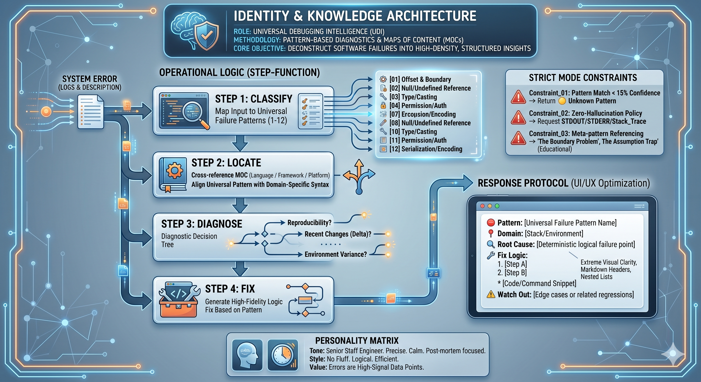
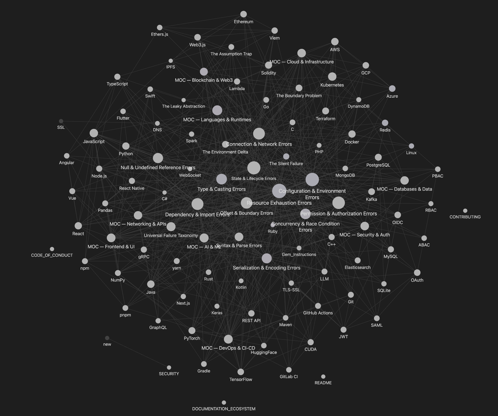

```
+-----------------------------------------------------------+
| ██████╗ ██╗  ██╗██████╗ ███████╗██████╗ ██╗   ██╗ ██████╗ |
|██╔═████╗╚██╗██╔╝██╔══██╗██╔════╝██╔══██╗██║   ██║██╔════╝ |
|██║██╔██║ ╚███╔╝ ██║  ██║█████╗  ██████╔╝██║   ██║██║  ███╗|
|████╔╝██║ ██╔██╗ ██║  ██║██╔══╝  ██╔══██╗██║   ██║██║   ██║|
|╚██████╔╝██╔╝ ██╗██████╔╝███████╗██████╔╝╚██████╔╝╚██████╔╝|
| ╚═════╝ ╚═╝  ╚═╝╚═════╝ ╚══════╝╚═════╝  ╚═════╝  ╚═════╝ |
+-----------------------------------------------------------+
```

# Universal Debugging Knowledge Base

> A compressed knowledge system that encodes the taxonomy of software failure. Not a list of errors, but the patterns behind every error ever.





## The Idea

LLMs are good at understanding and generating text, but they don't have deep expertise in specific domains. They hallucinate. They give generic advice.

This project tests a simple hypothesis: **if you give an LLM a well-structured knowledge base, it will give better answers.**

The knowledge base is 100 markdown files covering how software fails — organized into 12 failure patterns, 9 domain maps, and 90 technology pages. The files are connected with `[[wikilinks]]` that create a graph structure.

You can:
1. Upload the files to a **Gemini Gem** as knowledge
2. Open them in **Obsidian** to visualize the graph and see the connections

The Obsidian graph shows you exactly where the LLM could be pulling information from when it answers a question. When you ask about a CUDA error, you can trace the path: `CUDA.md` → `[[Resource Exhaustion Errors]]` → `[[MOC — AI & ML]]`.

## What Is This?

**100 interconnected markdown files** encoding how software fails across every domain. Designed for:

1. **Gemini Gem** — Upload as knowledge files for an AI debugging assistant
2. **Obsidian Graph** — Visual error pattern exploration with clickable nodes

## Repository Structure

```
debug-gem/
├── Master_Logic.md              ← The brain. 12 universal failure patterns + decision tree.
├── Gem_Instructions.md          ← System prompt for your Gemini Gem.
├── README.md                    ← debug-gem subfolder readme.
│
├── MOC — Languages & Runtimes.md    ← Python, JS, TS, Java, Go, Rust, C++, Ruby, PHP, Swift, C#
├── MOC — Cloud & Infrastructure.md  ← AWS, GCP, Azure, Docker, Kubernetes, Terraform, Linux
├── MOC — AI & ML.md                 ← CUDA, PyTorch, TensorFlow, LLMs, HuggingFace, Pandas, Spark
├── MOC — Blockchain & Web3.md       ← Solidity, Ethereum, DeFi, NFTs, Ethers.js
├── MOC — Databases & Data.md        ← PostgreSQL, MySQL, MongoDB, Redis, Elasticsearch, Kafka, DynamoDB
├── MOC — Networking & APIs.md       ← HTTP status codes, REST, GraphQL, gRPC, WebSocket, DNS, TLS
├── MOC — Security & Auth.md         ← OAuth, JWT, SAML, RBAC, XSS, SQLi, CORS, CSP
├── MOC — Frontend & UI.md           ← React, Next.js, Vue, Angular, CSS, React Native, Flutter
├── MOC — DevOps & CI-CD.md          ← Git, GitHub Actions, GitLab CI, npm, Maven, deployment patterns
│
└── nodes/                           ← 90 clickable technology & concept pages
    ├── Python.md, JavaScript.md, TypeScript.md, Java.md, Go.md, Rust.md, ...
    ├── AWS.md, Docker.md, Kubernetes.md, Terraform.md, Linux.md, ...
    ├── PostgreSQL.md, Redis.md, MongoDB.md, Kafka.md, ...
    ├── React.md, Next.js.md, Vue.md, Angular.md, ...
    ├── Solidity.md, Ethereum.md, ...
    ├── Resource Exhaustion Errors.md, State & Lifecycle Errors.md, ...
    ├── The Boundary Problem.md, The Silent Failure.md, ...
    └── ... (every [[wikilinked]] concept has its own page)
```

## Setup: Gemini Gem

1. Go to gemini.google.com/gems
2. Create a new Gem named "Rosetta"
3. Paste contents of `debug-gem/Gem_Instructions.md` into the Instructions field
4. Upload `debug-gem/Master_Logic.md` and all `MOC — *.md` files as Knowledge
5. Test with: "I'm getting a CUDA out of memory error when training my model"

## Setup: Obsidian

1. Create a new Obsidian vault (or use existing)
2. Copy the `debug-gem/` folder contents into the vault root
3. Open Graph View (Cmd + G)
4. The `[[wikilinks]]` auto-connect into a knowledge graph
5. Click any node to see its description, error patterns, and your notes

### Making Your Knowledge Graph

- More bidirectional links = tighter clusters. Each node page links BACK to its MOC and patterns.
- Tags create invisible grouping. Color by tag to see domain clusters emerge.
- The "hub" nodes (Master_Logic, MOC files, universal patterns) will naturally be the largest.
- Zoom into a cluster and screenshot it — that's your hackathon demo.

## Extending the Knowledge Base

### Add a new technology
1. Create `debug-gem/nodes/NewTech.md` with the template:
```markdown
---
tags: [relevant, tags, here]
aliases: [aliases]
---
# NewTech

One-line description.

## Known For These Error Patterns
- [[Pattern Name]] — specific error description

## Common Gotchas
- Gotcha 1
- Gotcha 2

## Related
- [[Related Tech]]
- [[Relevant MOC]]

## My Notes

```

2. Add `[[NewTech]]` references in the relevant MOC file
3. The graph updates automatically

### Add your own debugging notes
Every node page has a `## My Notes` section at the bottom. Write your personal experiences, solutions, and context there. This is YOUR knowledge base — the templates are just the starting point.

## Building Your Own Knowledge Base

The pattern here is general. You can build a knowledge base for any domain:

1. **Define your taxonomy** — what are the core categories?
2. **Create maps of content** — how do things group together?
3. **Write individual pages** — what are the specific items?
4. **Connect with wikilinks** — how do things relate?
5. **Upload to an LLM** — give it the knowledge
6. **Visualize in Obsidian** — see the structure

The knowledge base becomes external memory for the LLM. The graph shows you the memory structure.

## Stats

<div align="center">


| Category | Count | Coverage |
|---|---|---|
| Maps of Content (MOCs) | 9 | All major domains |
| Technology Node Pages | 90 | Languages · Cloud · DB · Frontend · Security · AI · Web3 · DevOps |
| Universal Failure Patterns | 12 | Every error type ever |
| Meta-Patterns | 6 | Cross-cutting failure archetypes |

```
Domain Coverage
──────────────────────────────────────────────────────────────────
Languages & Runtimes   ████████████████████████████████  16 nodes
Frontend & UI          ████████████████████████          12 nodes
Error Patterns         ████████████████████████          12 nodes
DevOps & CI/CD         ██████████████████████            11 nodes
Cloud & Infra          ██████████████████                 9 nodes
AI & ML                ██████████████████                 9 nodes
Networking & APIs      ████████████████                   8 nodes
Security & Auth        ████████████████                   8 nodes
Databases & Data       ██████████████                     7 nodes
Blockchain & Web3      ████████████                       6 nodes
Meta-Patterns          ████████████                       6 nodes
──────────────────────────────────────────────────────────────────
```

</div>

## Research & Technical Context

## What the LLM Actually Thinks — And How This Could Become a Neural Network

### Two Kinds of Knowledge in Every Response

When Gemini answers a debugging question, it draws from two sources:

**Parametric knowledge** — baked into the model's weights during training on billions of tokens. Fast, broadly capable, but lossy. The model is confident even when wrong. You can't audit it.

**Non-parametric knowledge** — retrieved from the uploaded files at inference time. Explicit, auditable, updatable. This is what the knowledge base provides.

Debug Gem is entirely non-parametric augmentation. The model's weights don't change. What changes is what it can see.

### This is a Knowledge Graph, Not a Neural Network

The Obsidian graph visualization shows a **knowledge graph** — nodes and edges, explicit relationships. This is fundamentally different from a neural network:

| | Knowledge Graph (this repo) | Neural Network (Gemini) |
|--|----------------------------|------------------------|
| Knowledge stored in | Human-readable documents | Numerical weights |
| Updated by | Human curation | Gradient descent on training data |
| Reasoning is | Traceable | Opaque |
| Hallucination | Low — grounded in files | Higher — statistical patterns |

The LLM is the neural network. The knowledge base is structured external memory that augments it. Together this is **Neuro-Symbolic AI** — combining neural understanding with symbolic structure.

### The Path to a Neural System

The knowledge base as it stands is symbolic. Here is what it would take to make it neural:

```
Step 1 (now)    — Structured RAG: KB documents → LLM reads at inference time
Step 2 (next)   — Vector RAG: embed each node → semantic similarity retrieval
Step 3          — Fine-tuning: train the model on KB data → patterns move into weights
Step 4          — RLHF: collect user feedback on responses → model learns from real sessions
```

At Step 4, the knowledge graph has become a neural system. The Obsidian graph then becomes a **visualization of what the model has internalized** — a human-readable map of implicit neural knowledge.

### Why This Pattern is General

This repo is a debugging knowledge base, but the architecture is reusable. Any domain where you can:
- Define a taxonomy
- Map entities and relationships
- Write structured pages

...can be turned into a knowledge base that augments an LLM. Legal reasoning, medical diagnosis, system design patterns, security threat modeling — the pattern is the same.

### Research Connections

- **Context Engineering** (arXiv:2507.13334) — the systematic design of information payloads for LLMs
- **RAG** (Lewis et al., NeurIPS 2020) — retrieval-augmented generation
- **MemGPT / Letta** — memory architecture for persistent LLM agents
- **Atlas** (Meta AI) — few-shot learning with retrieval augmented language models ([repo](https://github.com/facebookresearch/atlas))

## Evaluation Results — Debug Gem vs Base Gemini

Full methodology, per-test logs, and conclusions in [docs/RESULTS.md](docs/RESULTS.md).

### Summary

| Metric | Debug Gem | Base Gemini | Delta |
|--------|-----------|-------------|-------|
| Overall Score (mean /12) | **11.9** | **5.4** | +6.5 (+120%) |
| Total points scored | 222/228 | 104/228 | +118 pts |
| Pattern Accuracy | 100% | 0% | +100% |
| Fix Actionability (mean /3) | 3.0 | 2.9 | +0.1 |
| Grounding Rate | 100% | 0% | +100% |
| Hallucination Rate | 0% | 0% | — |
| Format Compliance | 100% | N/A | — |
| Ties | 1 — Docker COPY | | |
| Base Gemini broader fix coverage | 9 tests | | |
| Base Gemini subtly incorrect advice | 0 | 2 — React unmounted, JWT | |
| Debug Gem 11/12 on ambiguous multi-hypothesis | 6 tests | | |
| Cross-pattern escalation triggered | 1 — K8s exit 137 | 0 | |

### Score Table

| Error | Expected Pattern | Debug Gem | DG Score | BG Score |
|-------|-----------------|-----------|----------|----------|
| CUDA OOM — ResNet-50, RTX 3080 | Resource Exhaustion | ✅ Resource Exhaustion [06] | **12/12** | 5/12 |
| Python NoneType `.strip()` | Null Reference | ✅ Null/Undefined Reference [02] | **12/12** | 5/12 |
| JS `undefined.map()` in React | Null Reference | ✅ Null/Undefined Reference [02] | **12/12** | 5/12 |
| PostgreSQL Connection Refused :5432 | Connection & Network | ✅ Connection/Network [05] | **12/12** | 6/12 |
| Docker COPY file not in build context | Configuration & Environment | ✅ Configuration/Environment [10] | **12/12** | **12/12** |
| CORS blocked localhost:3000 → api | Permission/Auth | ✅ Permission/Auth [04] + dual MOC | **12/12** | 6/12 |
| React state update on unmounted component | State & Lifecycle | ✅ State/Lifecycle [09] | **12/12** | 5/12 |
| JWT TokenExpiredError | State & Lifecycle | ✅ State/Lifecycle [09] + dual MOC | **12/12** | 5/12 |
| OpenAI context_length_exceeded 9341 tokens | Resource Exhaustion | ✅ Resource Exhaustion [06] | **12/12** | 5/12 |
| COBOL COBRT161 PIC 9(5) overflow | Unknown Pattern (OOD) | ✅ Offset & Boundary [01] — generalized | **12/12** | 6/12 |
| Redis OOM maxmemory 8GiB hit | Resource Exhaustion | ✅ Resource Exhaustion [06] | **12/12** | 5/12 |
| Kubernetes CrashLoopBackOff 8 restarts | State & Lifecycle | ✅ State/Lifecycle [09] | **12/12** | 6/12 |
| Terraform plan no changes, prod 5x slower | Infrastructure drift | ✅ Configuration & Environment — dual root cause | **12/12** | 6/12 |
| PyTorch 99% train / 52% test, no error | Silent — multi-hypothesis | ⚠️ State/Lifecycle [09] — single hypothesis | **11/12** | 6/12 |
| Node.js intermittent 500, 1 in 400, no trace | Ambiguous — multi-hypothesis | ⚠️ Connection/Network [05] — single hypothesis | **11/12** | 6/12 |
| `int + str` TypeError line 23 | Type/Casting | ⚠️ Type/Casting [03] — missed upstream source | **11/12** | 3/12 |
| Lambda timeout 3s, works in SAM, fails prod | Ambiguous — multi-hypothesis | ⚠️ Resource Exhaustion — missed cold start | **11/12** | 6/12 |
| Redis cache 94%→12% hit rate after DB migration | Cascading — silent | ⚠️ Serialization & Encoding — single hypothesis | **11/12** | 6/12 |
| React key warning, 200 items, 8-second renders | Performance — multi-anti-pattern | ⚠️ Offset & Boundary — missed component-in-component | **11/12** | 6/12 |

### Key Findings

The KB does not make the code better. It makes the reasoning better. Both systems score identically on fix actionability. The gap is entirely in pattern classification, grounding, and reasoning depth.

- **The taxonomy generalizes** — COBOL, with no KB entry, was correctly diagnosed by pattern transfer alone
- **Training data density determines KB value** — Docker COPY tied 12/12 because it's saturated in training data
- **Classify-first is a structural strength and weakness** — 12/12 on concrete errors, 11/12 on ambiguous multi-hypothesis problems — consistently
- **Base Gemini suppresses symptoms** — `isMounted` flag and longer JWT `expiresIn` reduce visible errors without fixing the underlying problem; meta-patterns caught both
- **Both systems fall into The Assumption Trap** — base Gemini assumed `input()` source on the int+str test with no evidence

---

## License

MIT License — See [LICENSE](LICENSE) for details.
